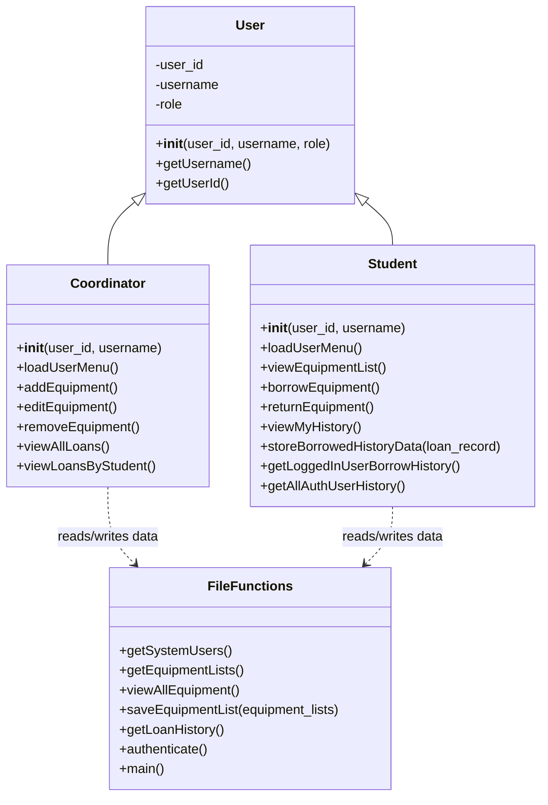
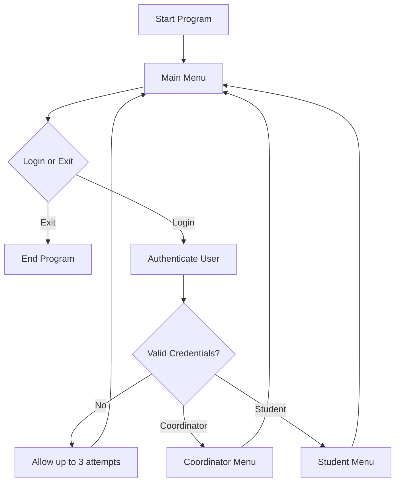

# Sports Equipment Loan System

A command-line Python application for managing sports equipment loans. The system supports two user roles: coordinators can manage equipment and view loan records, while students can view, borrow, return, and review their own equipment loan history.

## Table of Contents

- [Features](#features)
- [Project Structure](#project-structure)
- [Requirements](#requirements)
- [How to Run](#how-to-run)
- [Login Accounts](#login-accounts)
- [User Roles](#user-roles)
- [Class Diagram](#class-diagram)
- [Data Files](#data-files)
- [Main Program Flow](#main-program-flow)
- [Important Notes](#important-notes)

## Features

- User login with coordinator and student roles.
- Coordinator menu for adding, editing, removing, and viewing equipment.
- Coordinator access to all loan records and student-specific loan history.
- Student menu for viewing available equipment.
- Student borrowing with a maximum of two active borrowed items.
- Student return process that updates loan status and return date.
- JSON-based file storage for users, equipment, and loan history.
- Table-style output using `pandas`.

## Project Structure

```text
sportsEquipmentRenting/
├── sportsEquipmentLoanSystem.py
├── README.md
└── files/
    ├── users.txt
    ├── equipment_lists.txt
    └── loan_history.txt
```

## Requirements

- Python 3.8 or newer
- `pandas`

Install the required package:

```bash
pip install pandas
```

## How to Run

1. Open a terminal in the project folder.

2. Make sure the `files` folder exists and contains:

```text
files/users.txt
files/equipment_lists.txt
files/loan_history.txt
```

3. Run the program:

```bash
python sportsEquipmentLoanSystem.py
```

Depending on your system, you may need:

```bash
python3 sportsEquipmentLoanSystem.py
```

4. Select `1` from the main menu to log in, or `0` to exit.

## Login Accounts

The system reads login users from `files/users.txt`. Example accounts currently included are:

| Username | Password | Role |
| --- | --- | --- |
| `admin` | `admin` | Coordinator |
| `santoshshrestha.sh` | `P@ssw0rd` | Coordinator |
| `student` | `student` | Student |
| `bob` | `pass5678` | Student |
| `charlie` | `pass9012` | Student |
| `diana` | `pass3456` | Student |

## User Roles

### Coordinator

After logging in as a coordinator, the following options are available:

- Add new equipment.
- Edit existing equipment.
- Remove equipment.
- View all equipment.
- View all loan records.
- View loan history by student.
- Logout.

### Student

After logging in as a student, the following options are available:

- View available equipment.
- Borrow equipment.
- Return equipment.
- View personal loan history.
- Logout.

## Class Diagram



## Data Files

Although the files use the `.txt` extension, they contain JSON data.

### `files/users.txt`

Stores system users and login credentials.

```json
[
  {
    "user_id": 1,
    "username": "admin",
    "password": "admin",
    "role": "coordinator"
  }
]
```

Required fields:

- `user_id`: Numeric user identifier.
- `username`: Login username.
- `password`: Login password.
- `role`: Either `coordinator` or `student`.

### `files/equipment_lists.txt`

Stores all equipment records.

```json
[
  {
    "eq_id": "EQ010",
    "name": "Football",
    "category": "Ball",
    "type": "Football",
    "Quantity": "10"
  }
]
```

Required fields:

- `eq_id`: Unique equipment ID.
- `name`: Equipment name.
- `category`: Equipment category.
- `type`: Sport type.
- `Quantity`: Available quantity.

### `files/loan_history.txt`

Stores borrowing and return records.

```json
[
  {
    "loan_id": "LR-001",
    "student_id": 3,
    "equipment_id": "EQ010",
    "status": "Borrowed",
    "borrowed_date": "2026-05-09 14:30:00"
  }
]
```

Returned records may also include:

```json
{
  "return_date": "2026-05-09 15:00:00"
}
```

## Main Program Flow



## Important Notes

- Keep the `files` folder in the same directory as `sportsEquipmentLoanSystem.py`.
- The program expects valid JSON inside all three data files.
- The app currently stores passwords as plain text because it is a simple educational project.
- A student can have a maximum of two active borrowed items at a time.
- The current program records loan history in files and does not use a database.
- The program uses terminal color codes, so colors may display differently depending on the terminal.

## Common Errors

### `ModuleNotFoundError: No module named 'pandas'`

Install pandas:

```bash
pip install pandas
```

### File Not Found Error

Make sure the following files exist:

```text
files/users.txt
files/equipment_lists.txt
files/loan_history.txt
```

### Invalid JSON Error

If the program fails while reading a file, check that the file contains valid JSON. Each file should contain a JSON array, even if it is empty:

```json
[]
```

## Future Improvements

- Store passwords securely using hashing.
- Update equipment quantity when items are borrowed or returned.
- Add validation for duplicate loan IDs.
- Add due dates and late return handling.
- Replace text files with a database for larger systems.
- Add automated tests.
